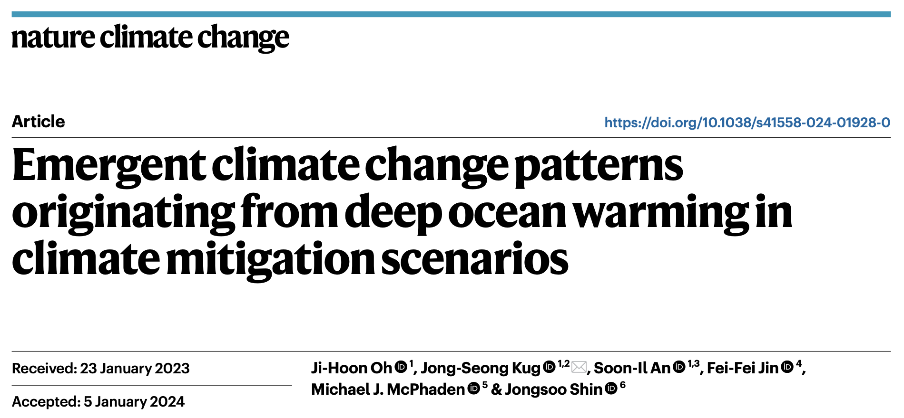
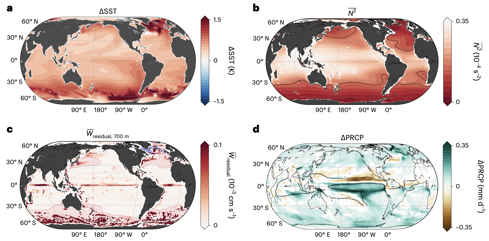

Hello, and welcome! I'm __Ji-Hoon Oh__, currently a postdoctoral research fellow at the [Scripps Institution of Oceanography (SIO)](https://scripps.ucsd.edu), working with [Prof. Shang-Ping Xie](https://scholar.google.com/citations?user=vGEx6O0AAAAJ&hl=ko&oi=ao). 
Prior to this, I was a postdoctoral researcher at Seoul National University (SNU). I hold both M.S. and Ph.D. from Pohang University of Science and Technology (POSTECH), where I studied under [Prof. Jong-Seong Kug](https://scholar.google.com/citations?user=PZF-9w0AAAAJ&hl=en). 
For more details on my academic background, please visit the [CV section](https://jhoh0926.github.io/resume/).
{:.note}

---
 
  __New Paper Alerts!__

 [__Oh et al. 2024__, __*Nature Climate Change*__](https://www.nature.com/articles/s41558-024-01928-0)  

This paper blah blah~~
{:.note}

<!--* [Upgrade]{:.heading.flip-title} --- You can skip this if you haven't used Hydejack before.
* [Config]{:.heading.flip-title} --- Once Jekyll is running you can start editing your config file.
{:.related-posts.faded}

## Using Hydejack
* [Basics]{:.heading.flip-title} --- How to add different types of content.
* [Writing]{:.heading.flip-title} --- Producing markdown content for Hydejack.
* [Scripts]{:.heading.flip-title} --- How to include 3rd party scripts on your site.
* [Build]{:.heading.flip-title} --- How to build the static files for deployment.
* [Deploy]{:.heading.flip-title} --- 🆕 How to deploy to a variety of popular providers.
* [Advanced]{:.heading.flip-title} --- Guides for more advanced tasks.
{:.related-posts.faded}

## Other
* [LICENSE]{:.heading.flip-title} --- The license of this project.
* [NOTICE]{:.heading.flip-title} --- Parts of this program are provided under separate licenses.
* [CHANGELOG]{:.heading.flip-title} --- Version history of Hydejack.
{:.related-posts.faded}

[install]: ./../example/_posts/2020-07-03-introducing-hydejack-9.md
[upgrade]: upgrade.md
[config]: config.md
[basics]: basics.md
[writing]: writing.md
[scripts]: scripts.md
[build]: build.md
[deploy]: deploy.md
[advanced]: advanced.md
[LICENSE]: ../LICENSE.md
[NOTICE]: ../NOTICE.md
[CHANGELOG]: ../CHANGELOG.md-->
